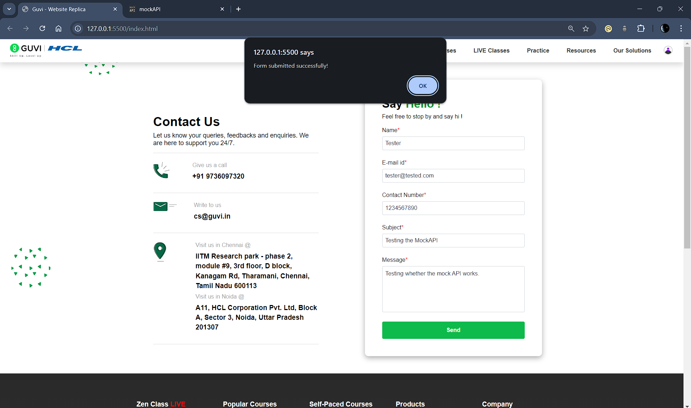
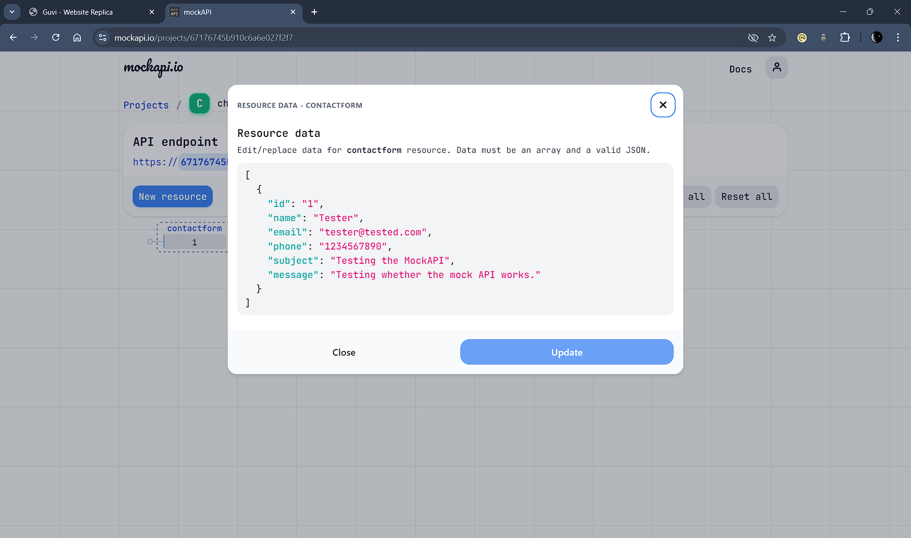

# FormHandling_and_MockAPI_using_TS

This project demonstrates form handling and interaction with a MockAPI using TypeScript. It includes a replica of GUVI website with a contact form and various UI elements styled using HTML and CSS.

## Features
- Responsive navigation bar
- Contact form with validation
- Integration with a mock API

## Screenshots
- Form Submission Successful Screenshot

- MockAPI Data Received Screenshot

